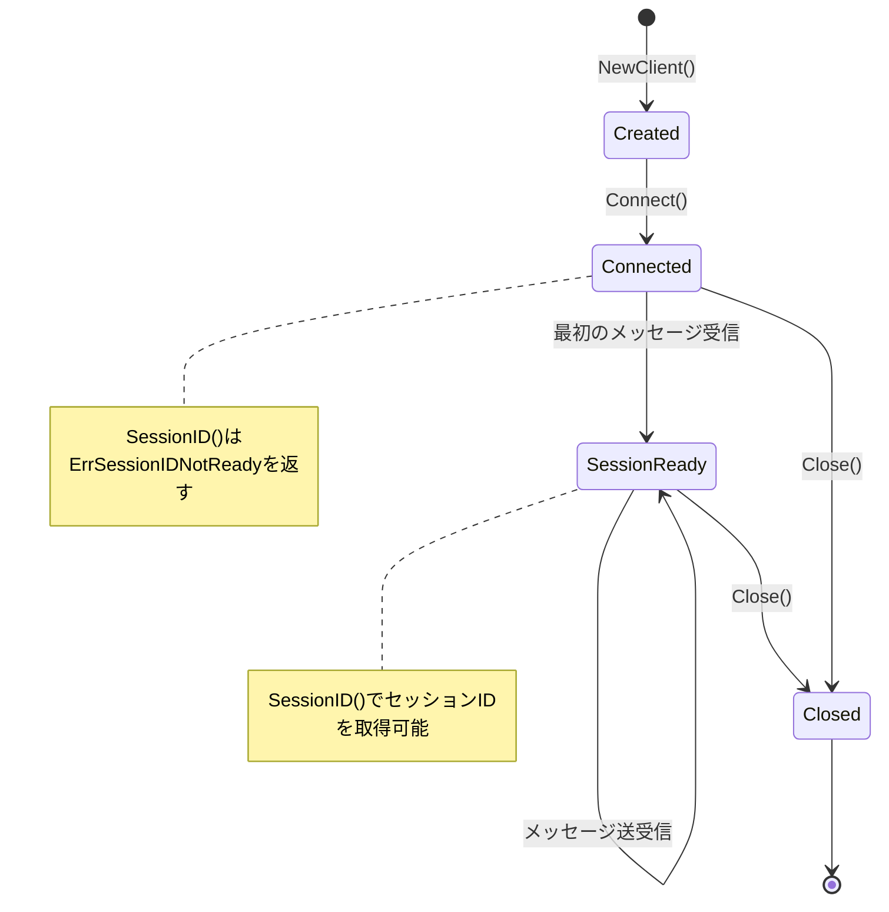

# Go Claude Agent SDK

Go言語によるClaude Agent SDK（非公式）

[](https://go.dev/)
[](LICENSE)

## 概要

Claude Code CLIと通信し、プログラムからClaudeのエージェント機能を利用するためのGoライブラリです。

公式SDK（[TypeScript](https://platform.claude.com/docs/en/agent-sdk/typescript) / [Python](https://github.com/anthropics/claude-agent-sdk-python)）の設計を参考に、同等の機能をGo言語で再実装しています。

### 実装状況

| 領域 | 完了率 |
|------|--------|
| コア関数 (Query, Session) | 100% |
| オプション | 67% |
| フックシステム | 58% |
| MCP統合 | 75% |
| **総合** | **約65%** |

詳細は[ロードマップ](docs/design/ROADMAP.md)を参照してください。

## 前提条件

- Go 1.23以上
- Claude Code CLI v2.0.0以上
- Claudeサブスクリプション（Pro/Max）

## インストール

```bash
go get github.com/y-oga-819/my-go-claude-agent
```

## クイックスタート

### ワンショットクエリ

最もシンプルな使い方。プロンプトを送信し、結果を受け取ります。

```go
package main

import (
    "context"
    "fmt"
    "log"

    "github.com/y-oga-819/my-go-claude-agent/claude"
)

func main() {
    ctx := context.Background()

    result, err := claude.Query(ctx, "Hello, Claude!", nil)
    if err != nil {
        log.Fatal(err)
    }

    fmt.Printf("Session: %s\n", result.SessionID)
    fmt.Printf("Cost: $%.4f\n", result.TotalCost)
}
```

### オプション付きクエリ

```go
result, err := claude.Query(ctx, "コードをレビューして", &claude.Options{
    CWD:            "/path/to/project",
    Model:          "claude-sonnet-4-5",
    MaxTurns:       5,
    PermissionMode: claude.PermissionModeAcceptEdits,
    SystemPrompt:   "あなたはコードレビューの専門家です",
})
```

### セッション管理

#### セッション継続（Resume）

前回のセッションを継続して、会話の文脈を保持できます。

```go
// 最初のクエリ
result1, _ := claude.Query(ctx, "私の名前は太郎です", nil)

// セッションを継続
result2, _ := claude.Query(ctx, "私の名前は？", &claude.Options{
    Resume: result1.SessionID,
})
// → "太郎さんです" と回答される
```

#### セッション分岐（Fork）

既存のセッションから分岐して、別の方向に会話を進められます。

```go
result, _ := claude.Query(ctx, "別のアプローチを試して", &claude.Options{
    Resume:      previousSessionID,
    ForkSession: true,
})
```

#### 直前のセッションを継続（Continue）

```go
result, _ := claude.Query(ctx, "続きをお願い", &claude.Options{
    Continue: true,
})
```

### 双方向ストリーミング

対話的な通信が必要な場合に使用します。

```go
client := claude.NewClient(&claude.Options{
    Model:    "claude-sonnet-4-5",
    MaxTurns: 10,
})

stream, err := client.Connect(ctx)
if err != nil {
    log.Fatal(err)
}
defer client.Close()

// メッセージ送信
stream.Send(ctx, "ファイルを読んで")

// レスポンス受信
for msg := range stream.Messages() {
    switch m := msg.(type) {
    case *protocol.AssistantMessage:
        fmt.Println(m.GetText())
    case *protocol.ResultMessage:
        fmt.Printf("完了: コスト $%.4f\n", m.TotalCostUSD)

        // SessionIDはメッセージ受信後に取得可能
        if sessionID, err := stream.SessionID(); err == nil {
            fmt.Printf("Session: %s\n", sessionID)
        }
    }
}
```

#### セッションの状態遷移



#### SessionIDの取得タイミング

`SessionID()`はCLIからの**最初のメッセージ受信後**に取得可能になります。

```go
stream, _ := client.Connect(ctx)

// ❌ この時点ではエラー（セッションIDが未確定）
sessionID, err := stream.SessionID()
// err == claude.ErrSessionIDNotReady

// メッセージ送受信
stream.Send(ctx, "Hello")
<-stream.Messages()  // 最初のメッセージを受信

// ✅ メッセージ受信後は取得可能
sessionID, err = stream.SessionID()
// err == nil, sessionID == "eb0d8754-6f07-4566-b82e-..."

// SessionIDReady()で事前チェックも可能
if stream.SessionIDReady() {
    sessionID, _ := stream.SessionID()
    // ...
}
```

| メソッド | 説明 |
|----------|------|
| `SessionID() (string, error)` | セッションIDを返す。未確定時は`ErrSessionIDNotReady`を返す |
| `SessionIDReady() bool` | セッションIDが取得可能かどうかを返す |

### フック（Hooks）

ツール実行の前後にカスタム処理を挿入できます。

```go
result, _ := claude.Query(ctx, "ファイルを編集して", &claude.Options{
    Hooks: &hooks.HookConfig{
        PreToolUse: []hooks.HookCallback{
            func(input hooks.HookInput) (*hooks.HookOutput, error) {
                fmt.Printf("ツール実行: %s\n", input.ToolName)
                return &hooks.HookOutput{Continue: true}, nil
            },
        },
        PostToolUse: []hooks.HookCallback{
            func(input hooks.HookInput) (*hooks.HookOutput, error) {
                fmt.Printf("ツール完了: %s\n", input.ToolName)
                return &hooks.HookOutput{Continue: true}, nil
            },
        },
    },
})
```

### 権限管理（canUseTool）

ツール使用の許可/拒否をプログラムで制御できます。

```go
result, _ := claude.Query(ctx, "ファイルを削除して", &claude.Options{
    CanUseTool: func(toolName string, input map[string]any) (*permission.PermissionResult, error) {
        // Bashコマンドのrmを禁止
        if toolName == "Bash" {
            if cmd, ok := input["command"].(string); ok && strings.Contains(cmd, "rm ") {
                return &permission.PermissionResult{
                    Behavior: permission.BehaviorDeny,
                    Message:  "削除コマンドは許可されていません",
                }, nil
            }
        }
        return &permission.PermissionResult{Behavior: permission.BehaviorAllow}, nil
    },
})
```

### MCP（Model Context Protocol）統合

外部MCPサーバーを接続して、Claudeに追加のツールを提供できます。

```go
result, _ := claude.Query(ctx, "データベースを検索して", &claude.Options{
    MCPServers: map[string]*mcp.ServerConfig{
        "my-database": {
            Command: "node",
            Args:    []string{"./mcp-server.js"},
            Env:     map[string]string{"DB_URL": "postgres://..."},
        },
    },
})
```

## Options一覧

| フィールド | 型 | 説明 |
|-----------|-----|------|
| `CLIPath` | `string` | CLIのパス（デフォルト: "claude"） |
| `CWD` | `string` | 作業ディレクトリ |
| `SystemPrompt` | `string` | システムプロンプト |
| `AppendSystemPrompt` | `string` | システムプロンプトへの追加 |
| `Model` | `string` | 使用するモデル |
| `FallbackModel` | `string` | フォールバックモデル |
| `MaxTurns` | `int` | 最大ターン数 |
| `MaxBudgetUSD` | `float64` | 最大予算（USD） |
| `PermissionMode` | `PermissionMode` | 権限モード |
| `AllowedTools` | `[]string` | 許可するツール |
| `DisallowedTools` | `[]string` | 禁止するツール |
| `Resume` | `string` | 再開するセッションID |
| `ForkSession` | `bool` | セッションを分岐するか |
| `Continue` | `bool` | 直前のセッションを継続 |
| `FileCheckpointing` | `bool` | ファイルチェックポイントを有効化 |
| `MCPServers` | `map[string]*ServerConfig` | MCPサーバー設定 |
| `Hooks` | `*HookConfig` | フック設定 |
| `CanUseTool` | `func` | ツール使用許可コールバック |

### PermissionMode

| モード | 説明 |
|--------|------|
| `PermissionModeDefault` | デフォルト（都度確認） |
| `PermissionModeAcceptEdits` | ファイル編集を自動許可 |
| `PermissionModePlan` | 読み取り専用（計画モード） |
| `PermissionModeBypassPermissions` | 全て自動許可 |

## パッケージ構成

```
claude/              # 公開API
  ├── query.go       # ワンショットQuery
  ├── client.go      # 双方向ストリーミングClient
  ├── session.go     # セッション管理
  ├── options.go     # オプション定義
  └── errors.go      # エラー定義

internal/
  ├── transport/     # CLI通信層（subprocess）
  ├── protocol/      # メッセージ・制御プロトコル
  ├── hooks/         # フックシステム
  ├── permission/    # 権限管理
  └── mcp/           # MCPサーバー統合
```

## ドキュメント

- [設計ドキュメント](docs/design/) - アーキテクチャと実装詳細
- [ロードマップ](docs/design/ROADMAP.md) - 公式SDKとの比較と今後の実装計画

## ライセンス

MIT License

## 参考

- [Claude Agent SDK - TypeScript](https://platform.claude.com/docs/en/agent-sdk/typescript)
- [Claude Agent SDK - Python](https://github.com/anthropics/claude-agent-sdk-python)
- [Claude Code CLI Reference](https://docs.anthropic.com/en/docs/claude-code)
