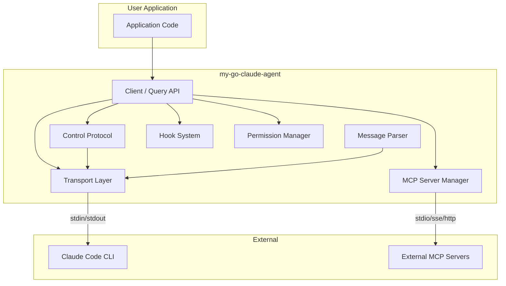
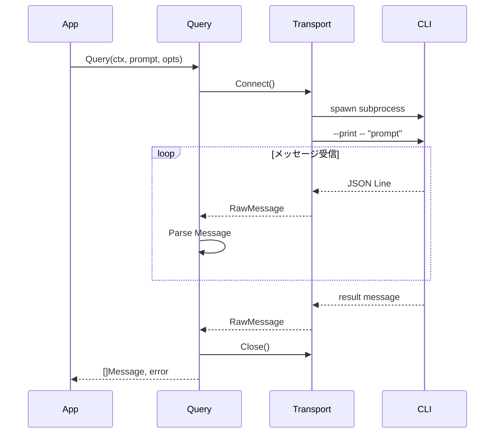
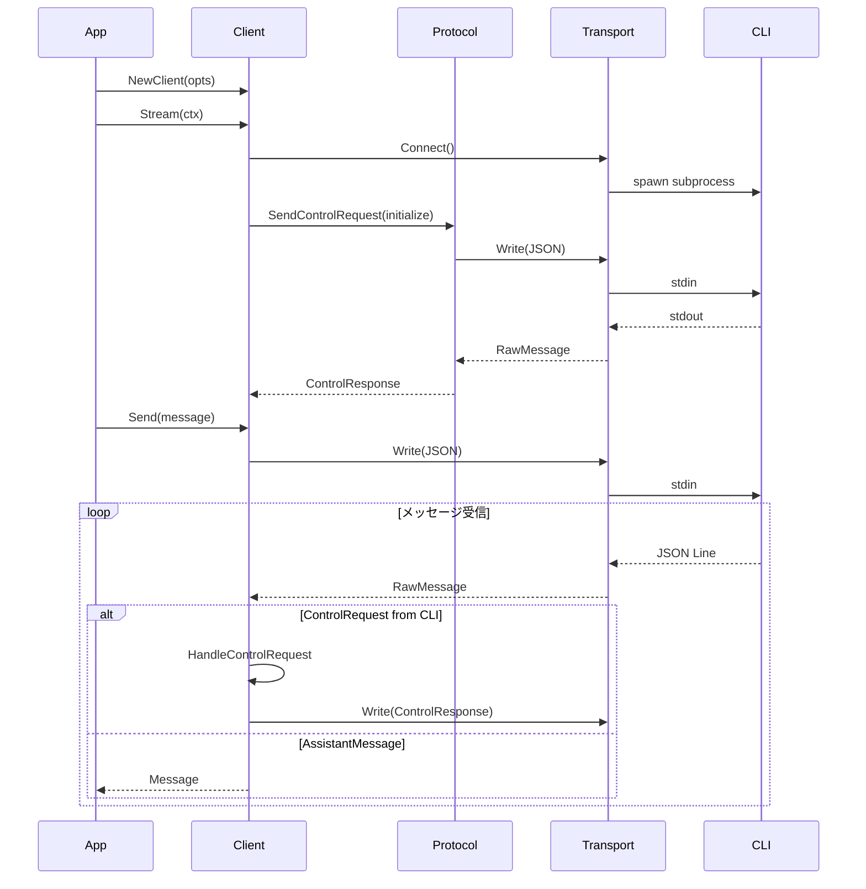

# アーキテクチャ設計

## システム構成図



## パッケージ構成

```
my-go-claude-agent/
├── claude/                   # 公開API
│   ├── client.go            # ClaudeClient（双方向ストリーミング）
│   ├── query.go             # Query関数（ワンショット）
│   ├── options.go           # ClaudeOptions型定義
│   └── errors.go            # 公開エラー型
├── internal/
│   ├── transport/           # 通信層
│   │   ├── transport.go     # Transportインターフェース
│   │   └── subprocess.go    # SubprocessTransport実装
│   ├── protocol/            # 制御プロトコル
│   │   ├── control.go       # 制御リクエスト/レスポンス
│   │   ├── messages.go      # メッセージ型定義
│   │   └── parser.go        # JSONパーサー
│   ├── hooks/               # フックシステム
│   │   ├── hooks.go         # フック定義
│   │   └── matcher.go       # ツールマッチャー
│   ├── permission/          # 権限管理
│   │   └── permission.go    # 権限判定ロジック
│   └── mcp/                 # MCPサーバー
│       ├── server.go        # SDKMCPServer
│       └── external.go      # 外部MCPサーバー管理
├── docs/
│   ├── design/
│   └── adr/
├── examples/                 # 使用例
│   ├── oneshot/
│   └── streaming/
├── go.mod
├── go.sum
└── README.md
```

## レイヤー構成

### 1. Public API Layer (`claude/`)

ユーザーが直接利用するAPI。

```go
// ワンショットクエリ
messages, err := claude.Query(ctx, "Hello, Claude!", opts)

// 双方向ストリーミング
client := claude.NewClient(opts)
stream, err := client.Stream(ctx)
for msg := range stream.Messages() {
    // メッセージ処理
}
```

### 2. Transport Layer (`internal/transport/`)

CLIプロセスとの通信を担当。

```go
type Transport interface {
    Connect(ctx context.Context) error
    Write(data []byte) error
    Messages() <-chan RawMessage
    Close() error
    EndInput() error
}
```

### 3. Protocol Layer (`internal/protocol/`)

JSON/RPCプロトコルの処理。

- メッセージのシリアライズ/デシリアライズ
- 制御リクエスト/レスポンスの管理
- リクエストIDによるレスポンスのマッチング

### 4. Hook Layer (`internal/hooks/`)

イベントフックの管理。

- PreToolUse, PostToolUse, UserPromptSubmit等
- ツール名マッチング（正規表現対応）
- タイムアウト管理

### 5. Permission Layer (`internal/permission/`)

ツール権限の管理。

- canUseToolコールバック
- 権限ルールの評価
- 権限モード（default, acceptEdits, plan, bypassPermissions）

### 6. MCP Layer (`internal/mcp/`)

MCPサーバーの管理。

- 外部MCPサーバー（stdio, sse, http）
- SDKMCPサーバー（インプロセス）

## データフロー

### ワンショットクエリ



### 双方向ストリーミング



## 制御プロトコル詳細

### リクエストID管理

```go
type PendingRequest struct {
    ID       string
    Response chan ControlResponse
    Timeout  time.Duration
}

type ProtocolHandler struct {
    pending map[string]*PendingRequest
    mu      sync.RWMutex
}
```

### コールバック処理

CLIからの制御リクエスト（can_use_tool, hook_callback, mcp_message）を
SDK側で処理し、レスポンスを返す。

```go
func (h *ProtocolHandler) HandleIncoming(msg RawMessage) error {
    switch msg.Type {
    case "control_request":
        return h.handleControlRequest(msg)
    case "assistant":
        return h.emitMessage(msg)
    case "result":
        return h.handleResult(msg)
    }
}
```

## エラーハンドリング

```go
// エラー階層
var (
    ErrCLINotFound     = errors.New("claude CLI not found")
    ErrCLIConnection   = errors.New("CLI connection error")
    ErrProcessExited   = errors.New("CLI process exited unexpectedly")
    ErrJSONDecode      = errors.New("JSON decode error")
    ErrMessageParse    = errors.New("message parse error")
    ErrControlTimeout  = errors.New("control request timeout")
)
```

## スレッドセーフティ

- Transport: メッセージチャネルによる非同期通信
- ProtocolHandler: sync.RWMutexによるpending map保護
- Client: 単一のgoroutineでメッセージループを実行
