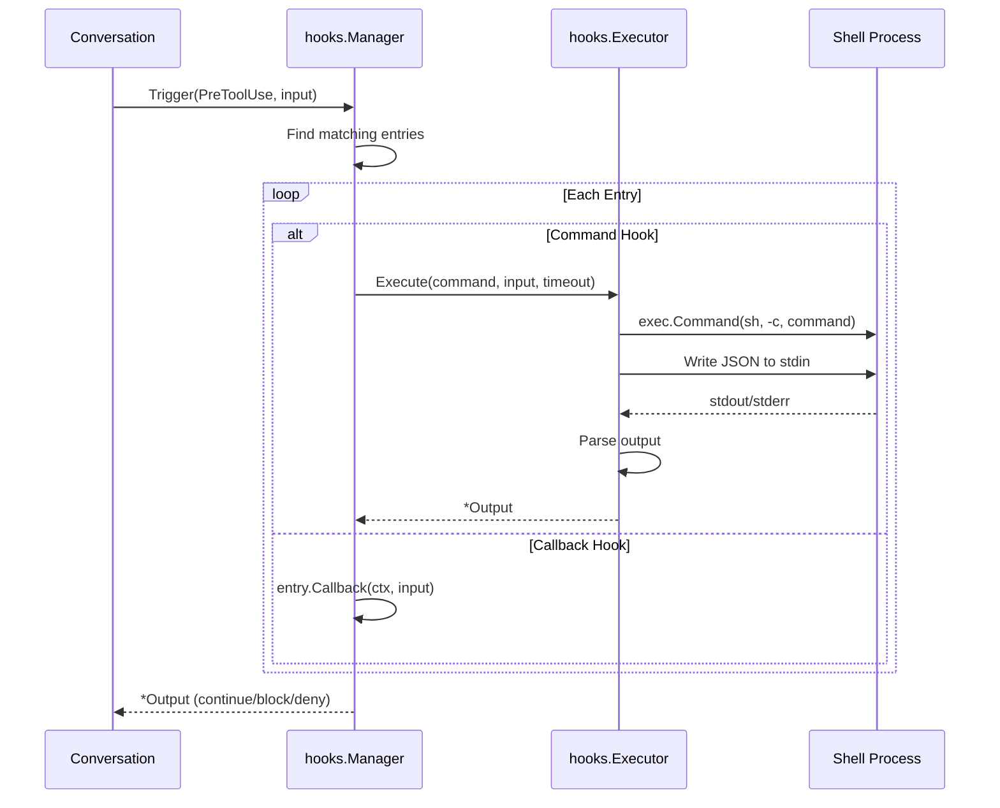

# Hook Execution 完全実装

## 目的・背景

現在のフックシステムはGoコールバック関数のみをサポートしている。Claude Code公式仕様に準拠し、外部シェルコマンドの実行機能を追加する。

### 現状
- `internal/hooks/hooks.go` - Manager、Entry、Input、Output構造体
- `internal/hooks/matcher.go` - 正規表現ベースのツールマッチング
- `claude/options.go` - HookConfig定義

### 追加する機能
- シェルコマンド実行（stdin経由でJSON入力、stdout/stderrで出力）
- タイムアウト制御
- 終了コードによる動作制御（0: 成功、2: ブロック、その他: 警告）
- Conversationフローへの統合

## アーキテクチャ



## 変更概要

### 新規ファイル

| ファイル | 役割 |
|----------|------|
| `internal/hooks/executor.go` | シェルコマンド実行ロジック |
| `internal/hooks/executor_test.go` | Executorのテスト |

### 変更ファイル

| ファイル | 変更内容 |
|----------|----------|
| `internal/hooks/hooks.go` | Entry構造体にCommand/Type追加、TriggerでExecutor呼び出し |
| `claude/options.go` | HookEntryにCommand/Type追加 |
| `claude/conversation.go` | ツール実行前後でフックをトリガー |

## 詳細設計

### Entry構造体の拡張

```go
// HookType はフックの種類
type HookType string

const (
    HookTypeCallback HookType = "callback" // Goコールバック（既存）
    HookTypeCommand  HookType = "command"  // シェルコマンド
)

// Entry はフックエントリ
type Entry struct {
    Type     HookType
    Matcher  *Matcher
    Callback Callback       // Type=callback時に使用
    Command  string         // Type=command時に使用
    Timeout  time.Duration  // デフォルト60秒
}
```

### Executor

```go
// Executor はシェルコマンドフックを実行する
type Executor struct {
    shell string // デフォルト: "sh"
}

// Execute はコマンドを実行しOutputを返す
func (e *Executor) Execute(ctx context.Context, command string, input *Input, timeout time.Duration) (*Output, error)
```

### 入力JSON形式（stdin）

```go
// CommandInput はコマンドに渡すJSON
type CommandInput struct {
    SessionID      string         `json:"session_id"`
    TranscriptPath string         `json:"transcript_path"`
    CWD            string         `json:"cwd"`
    HookEventName  string         `json:"hook_event_name"`
    ToolName       string         `json:"tool_name,omitempty"`
    ToolInput      map[string]any `json:"tool_input,omitempty"`
    ToolOutput     map[string]any `json:"tool_output,omitempty"`
    ToolUseID      string         `json:"tool_use_id,omitempty"`
}
```

### 出力JSON形式（stdout）

```go
// CommandOutput はコマンドからの出力JSON
type CommandOutput struct {
    Continue           bool                    `json:"continue"`
    StopReason         string                  `json:"stopReason,omitempty"`
    SuppressOutput     bool                    `json:"suppressOutput,omitempty"`
    Decision           string                  `json:"decision,omitempty"` // "block"
    SystemMessage      string                  `json:"systemMessage,omitempty"`
    Reason             string                  `json:"reason,omitempty"`
    HookSpecificOutput *CommandSpecificOutput  `json:"hookSpecificOutput,omitempty"`
}

// CommandSpecificOutput はフック固有の出力
type CommandSpecificOutput struct {
    HookEventName            string         `json:"hookEventName"`
    PermissionDecision       string         `json:"permissionDecision,omitempty"` // "allow", "deny", "ask"
    PermissionDecisionReason string         `json:"permissionDecisionReason,omitempty"`
    UpdatedInput             map[string]any `json:"updatedInput,omitempty"`
    AdditionalContext        string         `json:"additionalContext,omitempty"`
}
```

### 終了コード処理

| 終了コード | 動作 |
|-----------|------|
| 0 | 成功。stdoutをJSONとしてパース |
| 2 | ブロック。stderrをエラーメッセージとして使用 |
| その他 | 非ブロッキングエラー。処理継続 |

### Manager.Trigger の変更

```go
func (m *Manager) Trigger(ctx context.Context, event Event, input *Input) (*Output, error) {
    entries := m.getMatchingEntries(event, input.ToolName)

    for _, entry := range entries {
        var output *Output
        var err error

        switch entry.Type {
        case HookTypeCallback:
            output, err = entry.Callback(ctx, input)
        case HookTypeCommand:
            output, err = m.executor.Execute(ctx, entry.Command, input, entry.Timeout)
        }

        if err != nil {
            return nil, err
        }
        if !output.Continue {
            return output, nil
        }
    }

    return &Output{Continue: true}, nil
}
```

### Conversation統合

```go
// handleToolUse でフックを呼び出す
func (c *Conversation) handleToolUse(ctx context.Context, tool *protocol.ToolUse) error {
    // PreToolUse フック
    preInput := &hooks.Input{
        SessionID: c.sessionID,
        ToolName:  tool.Name,
        ToolInput: tool.Input,
    }
    preOutput, err := c.hookManager.Trigger(ctx, hooks.EventPreToolUse, preInput)
    if err != nil {
        return err
    }
    if !preOutput.Continue {
        // ツール実行をブロック
        return c.sendToolResult(tool.ID, preOutput.Reason, true)
    }

    // ツール実行...
    result, err := c.executeTool(ctx, tool)

    // PostToolUse フック
    postInput := &hooks.Input{
        SessionID:  c.sessionID,
        ToolName:   tool.Name,
        ToolInput:  tool.Input,
        ToolOutput: result,
    }
    postOutput, err := c.hookManager.Trigger(ctx, hooks.EventPostToolUse, postInput)
    // ...
}
```

## 環境変数

コマンド実行時に設定される環境変数：

| 変数名 | 説明 |
|--------|------|
| `CLAUDE_PROJECT_DIR` | プロジェクトルートの絶対パス |
| `CLAUDE_SESSION_ID` | 現在のセッションID |

## テスト計画

1. **Executor単体テスト**
   - 正常終了（exit 0）でJSONパース
   - ブロック終了（exit 2）でエラー返却
   - タイムアウト処理
   - 不正なJSON出力の処理

2. **Manager統合テスト**
   - CallbackとCommandの混在
   - マッチャーによるフィルタリング
   - 複数フックの連鎖実行

3. **Conversation統合テスト**
   - PreToolUseでのブロック
   - PostToolUseでの追加コンテキスト

## 完了条件

- [x] Executorがシェルコマンドを実行できる
- [x] JSON入出力が正しく処理される
- [x] タイムアウトが機能する
- [x] 終了コード別の処理が正しい
- [x] Clientからフックがトリガーされる
- [x] 全テストが通過する

## 実装ノート

- 設計ドキュメントでは `claude/conversation.go` への統合を想定していたが、実際には `claude/client.go` に統合
- Clientの `Send` メソッドで `UserPromptSubmit` フックをトリガー
- `TriggerHook` と `HookManager` メソッドを追加し、外部からもフックを操作可能に
