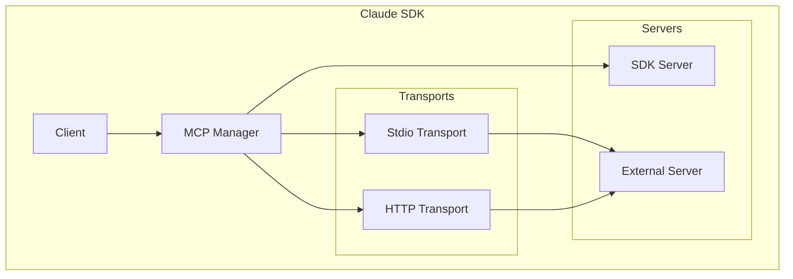
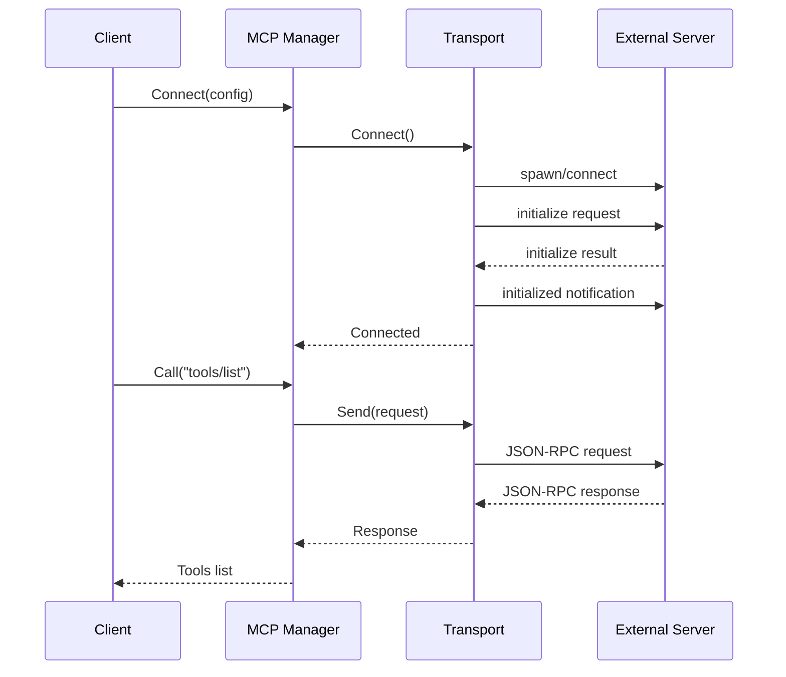
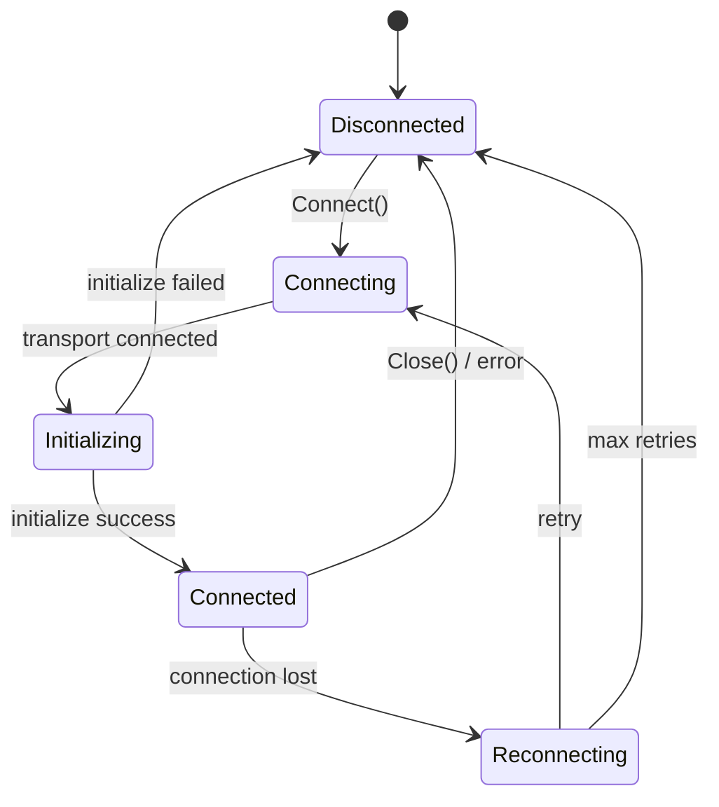

# MCP Server Integration 完全実装

## 目的・背景

現在のMCP実装は設定の定義とインプロセスサーバーのみをサポートしている。外部MCPサーバーとの実際の通信機能を追加する。

### 現状
- `internal/mcp/server.go` - SDKMCPServer（インプロセスMCPサーバー）
- `internal/mcp/external.go` - ServerConfig、Manager（設定管理のみ）
- JSON-RPC 2.0メッセージ構造

### 追加する機能
- stdioトランスポート（サブプロセス通信）
- HTTPトランスポート（HTTP POST + SSE）
- サーバーライフサイクル管理（起動、停止、再接続）
- プロトコル初期化ハンドシェイク
- Clientとの統合

## アーキテクチャ





## 変更概要

### 新規ファイル

| ファイル | 役割 |
|----------|------|
| `internal/mcp/transport.go` | Transport interface定義 |
| `internal/mcp/stdio.go` | Stdioトランスポート実装 |
| `internal/mcp/http.go` | HTTPトランスポート実装 |
| `internal/mcp/client.go` | MCPクライアント（高レベルAPI） |

### 変更ファイル

| ファイル | 変更内容 |
|----------|----------|
| `internal/mcp/external.go` | Manager拡張、接続管理追加 |
| `internal/mcp/server.go` | 初期化ハンドシェイク対応 |
| `claude/client.go` | MCP Manager統合 |

## 詳細設計

### Transport Interface

```go
// Transport はMCP通信のトランスポート層
type Transport interface {
    // Connect は接続を確立する
    Connect(ctx context.Context) error
    // Send はメッセージを送信する
    Send(msg *Message) error
    // Receive はメッセージを受信する
    Receive() (*Message, error)
    // Close は接続を閉じる
    Close() error
    // IsConnected は接続状態を返す
    IsConnected() bool
}
```

### Stdio Transport

```go
// StdioTransport はstdioベースのトランスポート
type StdioTransport struct {
    command string
    args    []string
    env     map[string]string

    cmd     *exec.Cmd
    stdin   io.WriteCloser
    stdout  *bufio.Reader
    stderr  io.ReadCloser

    mu      sync.Mutex
    closed  bool
}

func NewStdioTransport(config *ServerConfig) *StdioTransport

func (t *StdioTransport) Connect(ctx context.Context) error
func (t *StdioTransport) Send(msg *Message) error
func (t *StdioTransport) Receive() (*Message, error)
func (t *StdioTransport) Close() error
```

### HTTP Transport

```go
// HTTPTransport はHTTPベースのトランスポート
type HTTPTransport struct {
    url       string
    headers   map[string]string
    sessionID string

    client    *http.Client
    sseReader *bufio.Reader

    mu        sync.Mutex
    msgChan   chan *Message
    closed    bool
}

func NewHTTPTransport(config *ServerConfig) *HTTPTransport

func (t *HTTPTransport) Connect(ctx context.Context) error
func (t *HTTPTransport) Send(msg *Message) error
func (t *HTTPTransport) Receive() (*Message, error)
func (t *HTTPTransport) Close() error
```

### MCP Client

```go
// MCPClient は外部MCPサーバーとの通信を管理する
type MCPClient struct {
    name       string
    transport  Transport

    serverInfo *ServerInfo
    capabilities *Capabilities

    pendingReqs map[any]chan *Response
    msgChan     chan *Message
    errChan     chan error

    mu         sync.RWMutex
    connected  bool
}

// ServerInfo はサーバー情報
type ServerInfo struct {
    Name    string `json:"name"`
    Version string `json:"version"`
}

// Capabilities はサーバー能力
type Capabilities struct {
    Tools     *ToolsCapability     `json:"tools,omitempty"`
    Resources *ResourcesCapability `json:"resources,omitempty"`
    Prompts   *PromptsCapability   `json:"prompts,omitempty"`
}

func NewMCPClient(name string, transport Transport) *MCPClient

// Connect は接続と初期化を行う
func (c *MCPClient) Connect(ctx context.Context) error

// ListTools はツール一覧を取得する
func (c *MCPClient) ListTools(ctx context.Context) ([]ToolInfo, error)

// CallTool はツールを呼び出す
func (c *MCPClient) CallTool(ctx context.Context, name string, args map[string]any) (*ToolResult, error)

// Close は接続を閉じる
func (c *MCPClient) Close() error
```

### 初期化ハンドシェイク

```go
func (c *MCPClient) initialize(ctx context.Context) error {
    // 1. initialize request送信
    initReq := &Message{
        JSONRPC: "2.0",
        ID:      c.nextID(),
        Method:  "initialize",
        Params: map[string]any{
            "protocolVersion": "2025-06-18",
            "capabilities": map[string]any{},
            "clientInfo": map[string]any{
                "name":    "go-claude-agent",
                "version": "1.0.0",
            },
        },
    }

    resp, err := c.request(ctx, initReq)
    if err != nil {
        return err
    }

    // 2. サーバー情報を保存
    c.parseInitializeResult(resp.Result)

    // 3. initialized notification送信
    c.transport.Send(&Message{
        JSONRPC: "2.0",
        Method:  "notifications/initialized",
    })

    return nil
}
```

### Manager拡張

```go
// Manager拡張
type Manager struct {
    servers    map[string]*ServerConfig
    sdkServers map[string]*SDKMCPServer
    clients    map[string]*MCPClient  // 追加: 接続中のクライアント
    mu         sync.RWMutex
}

// ConnectServer は外部サーバーに接続する
func (m *Manager) ConnectServer(ctx context.Context, name string) error {
    config, ok := m.servers[name]
    if !ok {
        return fmt.Errorf("server not found: %s", name)
    }

    var transport Transport
    switch config.Type {
    case TransportStdio:
        transport = NewStdioTransport(config)
    case TransportHTTP, TransportSSE:
        transport = NewHTTPTransport(config)
    }

    client := NewMCPClient(name, transport)
    if err := client.Connect(ctx); err != nil {
        return err
    }

    m.mu.Lock()
    m.clients[name] = client
    m.mu.Unlock()

    return nil
}

// DisconnectServer はサーバーから切断する
func (m *Manager) DisconnectServer(name string) error

// GetClient は接続中のクライアントを取得する
func (m *Manager) GetClient(name string) (*MCPClient, bool)

// CallTool はツールを呼び出す（SDK/外部両対応）
func (m *Manager) CallTool(ctx context.Context, serverName, toolName string, args map[string]any) (*ToolResult, error)
```

## メッセージ形式

### JSON-RPC 2.0

```go
// Message はJSON-RPC 2.0メッセージ（既存）
type Message struct {
    JSONRPC string `json:"jsonrpc"`
    ID      any    `json:"id,omitempty"`     // request/response
    Method  string `json:"method,omitempty"` // request/notification
    Params  any    `json:"params,omitempty"` // request
    Result  any    `json:"result,omitempty"` // response
    Error   *Error `json:"error,omitempty"`  // response
}
```

### Stdio メッセージ区切り

- 各メッセージは改行（`\n`）で区切る
- メッセージ内に改行を含めない

### HTTP ヘッダー

```
POST /mcp HTTP/1.1
Content-Type: application/json
Accept: application/json, text/event-stream
Mcp-Session-Id: <session-id>  # 初回以降
MCP-Protocol-Version: 2025-06-18
```

## 状態遷移



## エラーハンドリング

| エラー | 対処 |
|--------|------|
| 接続失敗 | リトライ（指数バックオフ） |
| 初期化失敗 | エラー返却 |
| タイムアウト | リクエストキャンセル |
| 接続断 | 自動再接続 |
| プロトコルエラー | エラー返却 |

## テスト計画

1. **Stdio Transport テスト**
   - プロセス起動・終了
   - メッセージ送受信
   - エラーハンドリング

2. **HTTP Transport テスト**
   - HTTP POST/GET
   - SSE ストリーム
   - セッション管理

3. **MCP Client テスト**
   - 初期化ハンドシェイク
   - tools/list, tools/call
   - タイムアウト処理

4. **Manager 統合テスト**
   - 複数サーバー管理
   - SDK/外部サーバー統合

## 実装フェーズ

### Phase 1: Stdio Transport（優先）
- Stdioトランスポート実装
- MCPClient基本実装
- 初期化ハンドシェイク

### Phase 2: HTTP Transport
- HTTPトランスポート実装
- SSEサポート
- セッション管理

### Phase 3: Client統合
- Manager拡張
- Claude Client統合
- エラーハンドリング強化

## 完了条件

- [ ] StdioTransportがサブプロセスと通信できる
- [ ] HTTPTransportがHTTPサーバーと通信できる
- [ ] MCPClientが初期化ハンドシェイクを完了できる
- [ ] tools/list, tools/callが動作する
- [ ] Managerが複数サーバーを管理できる
- [ ] 全テストが通過する
