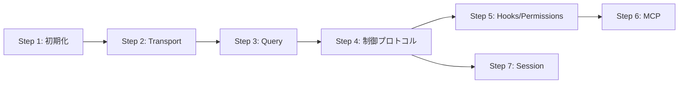

# 実装Steps

## 概要

my-go-claude-agentの実装を段階的に進めるためのStep分割。
各Stepは独立してテスト可能な単位で設計。

## Step一覧

| Step | 内容 | 依存 | 成果物 |
|------|------|------|--------|
| Step 1 | プロジェクト初期化・型定義 | - | go.mod, 基本型 |
| Step 2 | Transport層実装 | Step 1 | CLIプロセス起動・通信 |
| Step 3 | ワンショットQuery実装 | Step 2 | Query関数 |
| Step 4 | 制御プロトコル実装 | Step 3 | 双方向通信 |
| Step 5 | フック・権限管理実装 | Step 4 | canUseTool, Hooks |
| Step 6 | MCPサーバー統合 | Step 5 | MCP対応 |
| Step 7 | セッション管理 | Step 4 | resume, fork |

## 実装順序

## MVP（最小実装）

Step 1〜3で最小限動作するSDKが完成する。
- CLIを起動してプロンプトを送信
- レスポンスをストリーミング受信
- 結果を返却
