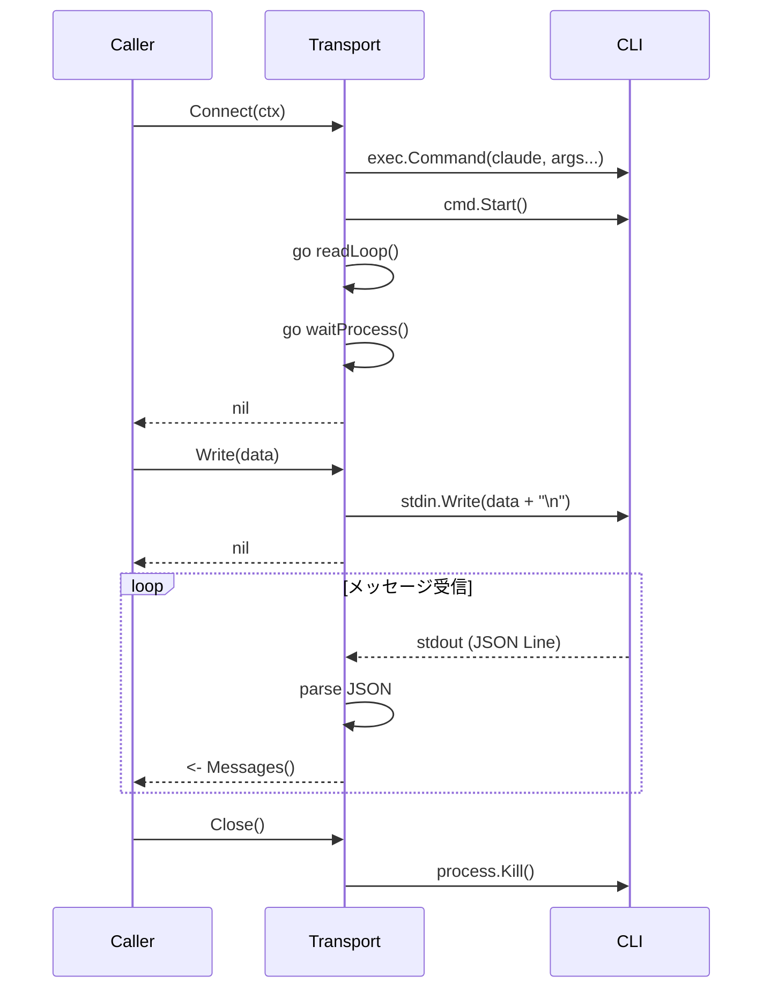

# Step 2: Transport層実装

## 目的

Claude Code CLIをサブプロセスとして起動し、stdin/stdout経由で通信する機能を実装する。

## 成果物

- `internal/transport/transport.go` - インターフェース定義
- `internal/transport/subprocess.go` - サブプロセス実装

## 実装内容

### 2.1 Transportインターフェース (`internal/transport/transport.go`)

```go
package transport

import "context"

// RawMessage はCLIから受信した生のJSONメッセージ
type RawMessage struct {
    Type string
    Data map[string]any
    Raw  []byte // 元のJSON
}

// Transport はCLIとの通信を抽象化するインターフェース
type Transport interface {
    // Connect はCLIプロセスを起動して接続する
    Connect(ctx context.Context) error

    // Write はCLIのstdinにデータを書き込む
    Write(data []byte) error

    // Messages は受信メッセージのチャネルを返す
    Messages() <-chan RawMessage

    // Errors はエラーのチャネルを返す
    Errors() <-chan error

    // EndInput はstdinをクローズする（ワンショットモード用）
    EndInput() error

    // Close はプロセスを終了する
    Close() error

    // IsConnected は接続状態を返す
    IsConnected() bool
}

// Config はTransportの設定
type Config struct {
    CLIPath        string            // CLIのパス
    Args           []string          // コマンドライン引数
    Env            map[string]string // 追加の環境変数
    CWD            string            // 作業ディレクトリ
    StreamingMode  bool              // 双方向ストリーミングモード
    MaxBufferSize  int               // JSONバッファの最大サイズ
}
```

### 2.2 SubprocessTransport (`internal/transport/subprocess.go`)

```go
package transport

import (
    "bufio"
    "context"
    "encoding/json"
    "fmt"
    "io"
    "os"
    "os/exec"
    "strings"
    "sync"
)

const (
    DefaultMaxBufferSize = 10 * 1024 * 1024 // 10MB
    DefaultCLIPath       = "claude"
)

type SubprocessTransport struct {
    config Config

    cmd    *exec.Cmd
    stdin  io.WriteCloser
    stdout io.ReadCloser
    stderr io.ReadCloser

    msgChan   chan RawMessage
    errChan   chan error
    closeChan chan struct{}

    mu        sync.RWMutex
    connected bool
    closed    bool
}

func NewSubprocessTransport(config Config) *SubprocessTransport {
    if config.CLIPath == "" {
        config.CLIPath = DefaultCLIPath
    }
    if config.MaxBufferSize == 0 {
        config.MaxBufferSize = DefaultMaxBufferSize
    }

    return &SubprocessTransport{
        config:    config,
        msgChan:   make(chan RawMessage, 100),
        errChan:   make(chan error, 10),
        closeChan: make(chan struct{}),
    }
}

func (t *SubprocessTransport) Connect(ctx context.Context) error {
    t.mu.Lock()
    defer t.mu.Unlock()

    if t.connected {
        return nil
    }

    // コマンド構築
    args := t.buildArgs()
    t.cmd = exec.CommandContext(ctx, t.config.CLIPath, args...)

    // 環境変数設定
    t.cmd.Env = t.buildEnv()
    t.cmd.Dir = t.config.CWD

    // パイプ設定
    var err error
    t.stdin, err = t.cmd.StdinPipe()
    if err != nil {
        return fmt.Errorf("stdin pipe: %w", err)
    }

    t.stdout, err = t.cmd.StdoutPipe()
    if err != nil {
        return fmt.Errorf("stdout pipe: %w", err)
    }

    t.stderr, err = t.cmd.StderrPipe()
    if err != nil {
        return fmt.Errorf("stderr pipe: %w", err)
    }

    // プロセス起動
    if err := t.cmd.Start(); err != nil {
        return fmt.Errorf("start CLI: %w", err)
    }

    t.connected = true

    // 読み取りgoroutine開始
    go t.readLoop()
    go t.readStderr()
    go t.waitProcess()

    return nil
}

func (t *SubprocessTransport) buildArgs() []string {
    args := []string{
        "--output-format", "stream-json",
        "--verbose",
    }

    if t.config.StreamingMode {
        args = append(args, "--input-format", "stream-json")
    }

    args = append(args, t.config.Args...)
    return args
}

func (t *SubprocessTransport) buildEnv() []string {
    env := os.Environ()

    // SDK固有の環境変数
    sdkEnv := map[string]string{
        "CLAUDE_CODE_ENTRYPOINT":    "sdk-go",
        "CLAUDE_AGENT_SDK_VERSION":  "0.1.0",
    }

    for k, v := range t.config.Env {
        sdkEnv[k] = v
    }

    for k, v := range sdkEnv {
        env = append(env, k+"="+v)
    }

    return env
}

func (t *SubprocessTransport) readLoop() {
    defer close(t.msgChan)

    scanner := bufio.NewScanner(t.stdout)
    buf := make([]byte, 0, bufio.MaxScanTokenSize)
    scanner.Buffer(buf, t.config.MaxBufferSize)

    var jsonBuffer strings.Builder

    for scanner.Scan() {
        select {
        case <-t.closeChan:
            return
        default:
        }

        line := strings.TrimSpace(scanner.Text())
        if line == "" {
            continue
        }

        jsonBuffer.WriteString(line)

        var data map[string]any
        raw := jsonBuffer.String()
        if err := json.Unmarshal([]byte(raw), &data); err == nil {
            // 完全なJSONを取得
            msgType, _ := data["type"].(string)
            t.msgChan <- RawMessage{
                Type: msgType,
                Data: data,
                Raw:  []byte(raw),
            }
            jsonBuffer.Reset()
        } else if jsonBuffer.Len() > t.config.MaxBufferSize {
            t.errChan <- fmt.Errorf("JSON buffer overflow: %d bytes", jsonBuffer.Len())
            jsonBuffer.Reset()
        }
        // 不完全な場合は次の行を待つ
    }

    if err := scanner.Err(); err != nil {
        t.errChan <- fmt.Errorf("stdout read: %w", err)
    }
}

func (t *SubprocessTransport) readStderr() {
    scanner := bufio.NewScanner(t.stderr)
    for scanner.Scan() {
        // stderrはデバッグログとして扱う（必要に応じてログ出力）
        _ = scanner.Text()
    }
}

func (t *SubprocessTransport) waitProcess() {
    err := t.cmd.Wait()
    t.mu.Lock()
    t.connected = false
    t.mu.Unlock()

    if err != nil {
        t.errChan <- fmt.Errorf("CLI process exited: %w", err)
    }
    close(t.errChan)
}

func (t *SubprocessTransport) Write(data []byte) error {
    t.mu.RLock()
    defer t.mu.RUnlock()

    if !t.connected || t.stdin == nil {
        return fmt.Errorf("not connected")
    }

    // 改行を追加（JSON Lines形式）
    if !strings.HasSuffix(string(data), "\n") {
        data = append(data, '\n')
    }

    _, err := t.stdin.Write(data)
    return err
}

func (t *SubprocessTransport) Messages() <-chan RawMessage {
    return t.msgChan
}

func (t *SubprocessTransport) Errors() <-chan error {
    return t.errChan
}

func (t *SubprocessTransport) EndInput() error {
    t.mu.Lock()
    defer t.mu.Unlock()

    if t.stdin != nil {
        return t.stdin.Close()
    }
    return nil
}

func (t *SubprocessTransport) Close() error {
    t.mu.Lock()
    defer t.mu.Unlock()

    if t.closed {
        return nil
    }
    t.closed = true

    close(t.closeChan)

    if t.stdin != nil {
        t.stdin.Close()
    }

    if t.cmd != nil && t.cmd.Process != nil {
        t.cmd.Process.Kill()
    }

    return nil
}

func (t *SubprocessTransport) IsConnected() bool {
    t.mu.RLock()
    defer t.mu.RUnlock()
    return t.connected && !t.closed
}
```

## シーケンス図



## テスト

- モックCLIを使った接続テスト
- JSONバッファリングテスト（分割されたJSON）
- エラーハンドリングテスト

## 完了条件

- [ ] CLIプロセスを起動できる
- [ ] stdin/stdoutで通信できる
- [ ] 分割されたJSONを正しくバッファリングできる
- [ ] プロセス終了を検知できる
- [ ] 正常にクリーンアップできる
