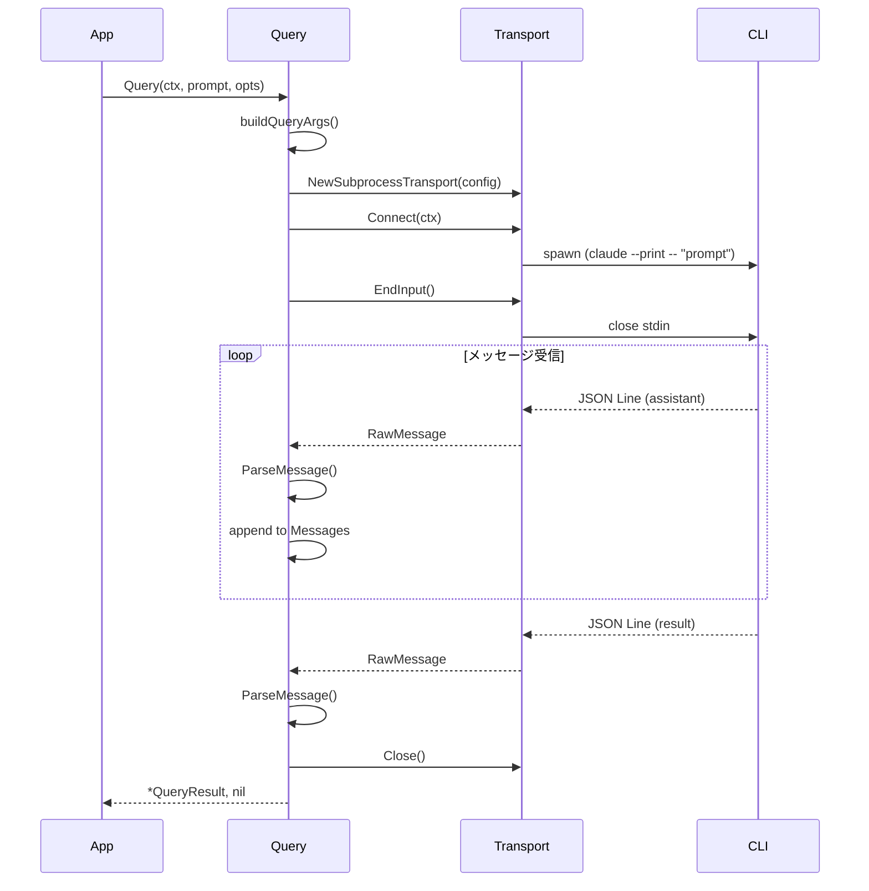

# Step 3: ワンショットQuery実装

## 目的

単一のプロンプトを送信し、結果を受け取るワンショットクエリ機能を実装する。
これがMVP（最小実装）となる。

## 成果物

- `claude/query.go` - Query関数
- `internal/protocol/parser.go` - メッセージパーサー

## 実装内容

### 3.1 メッセージパーサー (`internal/protocol/parser.go`)

```go
package protocol

import (
    "encoding/json"
    "fmt"
)

// ParseMessage は生のJSONデータをメッセージ型に変換する
func ParseMessage(data map[string]any) (Message, error) {
    msgType, ok := data["type"].(string)
    if !ok {
        return nil, fmt.Errorf("missing message type")
    }

    raw, err := json.Marshal(data)
    if err != nil {
        return nil, fmt.Errorf("marshal: %w", err)
    }

    switch msgType {
    case "user":
        var msg UserMessage
        if err := json.Unmarshal(raw, &msg); err != nil {
            return nil, fmt.Errorf("parse user message: %w", err)
        }
        return &msg, nil

    case "assistant":
        var msg AssistantMessage
        if err := json.Unmarshal(raw, &msg); err != nil {
            return nil, fmt.Errorf("parse assistant message: %w", err)
        }
        return &msg, nil

    case "system":
        var msg SystemMessage
        if err := json.Unmarshal(raw, &msg); err != nil {
            return nil, fmt.Errorf("parse system message: %w", err)
        }
        return &msg, nil

    case "result":
        var msg ResultMessage
        if err := json.Unmarshal(raw, &msg); err != nil {
            return nil, fmt.Errorf("parse result message: %w", err)
        }
        return &msg, nil

    case "control_request":
        var msg ControlRequest
        if err := json.Unmarshal(raw, &msg); err != nil {
            return nil, fmt.Errorf("parse control request: %w", err)
        }
        return &msg, nil

    case "control_response":
        var msg ControlResponse
        if err := json.Unmarshal(raw, &msg); err != nil {
            return nil, fmt.Errorf("parse control response: %w", err)
        }
        return &msg, nil

    default:
        // 未知のメッセージ型は汎用マップで返す
        return &GenericMessage{Type: msgType, Data: data}, nil
    }
}

// GenericMessage は未知のメッセージ型を表す
type GenericMessage struct {
    Type string
    Data map[string]any
}

func (m *GenericMessage) MessageType() string { return m.Type }
```

### 3.2 Query関数 (`claude/query.go`)

```go
package claude

import (
    "context"
    "fmt"

    "github.com/y-oga-819/my-go-claude-agent/internal/protocol"
    "github.com/y-oga-819/my-go-claude-agent/internal/transport"
)

// QueryResult はクエリの結果を表す
type QueryResult struct {
    Messages   []protocol.Message
    Result     *protocol.ResultMessage
    SessionID  string
    TotalCost  float64
    Usage      protocol.Usage
}

// Query は単一のプロンプトを送信し、結果を返す
func Query(ctx context.Context, prompt string, opts *Options) (*QueryResult, error) {
    if opts == nil {
        opts = &Options{}
    }

    // Transport設定
    config := transport.Config{
        CLIPath:       opts.CLIPath,
        CWD:           opts.CWD,
        StreamingMode: false, // ワンショットモード
        Args:          buildQueryArgs(prompt, opts),
    }

    t := transport.NewSubprocessTransport(config)

    // 接続
    if err := t.Connect(ctx); err != nil {
        return nil, &SDKError{Op: "connect", Err: ErrCLIConnection, Details: err.Error()}
    }
    defer t.Close()

    // stdinをクローズしてプロンプト送信完了を通知
    if err := t.EndInput(); err != nil {
        return nil, &SDKError{Op: "end_input", Err: err}
    }

    // メッセージ収集
    result := &QueryResult{
        Messages: make([]protocol.Message, 0),
    }

    for {
        select {
        case <-ctx.Done():
            return nil, ctx.Err()

        case err := <-t.Errors():
            if err != nil {
                return nil, &SDKError{Op: "receive", Err: err}
            }

        case rawMsg, ok := <-t.Messages():
            if !ok {
                // チャネルがクローズされた
                if result.Result == nil {
                    return nil, &SDKError{Op: "receive", Err: ErrProcessExited}
                }
                return result, nil
            }

            msg, err := protocol.ParseMessage(rawMsg.Data)
            if err != nil {
                return nil, &SDKError{Op: "parse", Err: ErrMessageParse, Details: err.Error()}
            }

            switch m := msg.(type) {
            case *protocol.AssistantMessage:
                result.Messages = append(result.Messages, m)

            case *protocol.SystemMessage:
                result.Messages = append(result.Messages, m)

            case *protocol.ResultMessage:
                result.Result = m
                result.SessionID = m.SessionID
                result.TotalCost = m.TotalCostUSD
                result.Usage = m.Usage
                // 結果を受け取ったら終了
                return result, nil
            }
        }
    }
}

func buildQueryArgs(prompt string, opts *Options) []string {
    args := []string{}

    // プロンプト（ワンショットモード）
    args = append(args, "--print", "--", prompt)

    // システムプロンプト
    if opts.SystemPrompt != "" {
        args = append(args, "--system-prompt", opts.SystemPrompt)
    }
    if opts.AppendSystemPrompt != "" {
        args = append(args, "--append-system-prompt", opts.AppendSystemPrompt)
    }

    // モデル設定
    if opts.Model != "" {
        args = append(args, "--model", opts.Model)
    }
    if opts.FallbackModel != "" {
        args = append(args, "--fallback-model", opts.FallbackModel)
    }

    // 制限設定
    if opts.MaxTurns > 0 {
        args = append(args, "--max-turns", fmt.Sprintf("%d", opts.MaxTurns))
    }
    if opts.MaxBudgetUSD > 0 {
        args = append(args, "--max-budget-usd", fmt.Sprintf("%.2f", opts.MaxBudgetUSD))
    }

    // 権限設定
    if opts.PermissionMode != "" {
        args = append(args, "--permission-mode", string(opts.PermissionMode))
    }
    if len(opts.AllowedTools) > 0 {
        args = append(args, "--allowedTools", joinTools(opts.AllowedTools))
    }
    if len(opts.DisallowedTools) > 0 {
        args = append(args, "--disallowedTools", joinTools(opts.DisallowedTools))
    }

    // セッション設定
    if opts.Resume != "" {
        args = append(args, "--resume", opts.Resume)
    }

    return args
}

func joinTools(tools []string) string {
    result := ""
    for i, t := range tools {
        if i > 0 {
            result += ","
        }
        result += t
    }
    return result
}
```

### 3.3 使用例

```go
package main

import (
    "context"
    "fmt"
    "log"

    "github.com/y-oga-819/my-go-claude-agent/claude"
)

func main() {
    ctx := context.Background()

    result, err := claude.Query(ctx, "Hello, Claude! What is 2+2?", &claude.Options{
        MaxTurns: 1,
    })
    if err != nil {
        log.Fatal(err)
    }

    fmt.Printf("Session: %s\n", result.SessionID)
    fmt.Printf("Cost: $%.4f\n", result.TotalCost)
    fmt.Printf("Tokens: %d input, %d output\n",
        result.Usage.InputTokens, result.Usage.OutputTokens)

    for _, msg := range result.Messages {
        if am, ok := msg.(*protocol.AssistantMessage); ok {
            for _, block := range am.Message.Content {
                if block.Type == "text" {
                    fmt.Printf("Claude: %s\n", block.Text)
                }
            }
        }
    }
}
```

## シーケンス図



## テスト

- 正常系：プロンプト送信→レスポンス受信
- エラー系：CLIが見つからない
- エラー系：プロセスが異常終了
- オプションのコマンドライン引数変換テスト

## 完了条件

- [ ] Query関数が動作する
- [ ] オプションがコマンドライン引数に正しく変換される
- [ ] メッセージが正しくパースされる
- [ ] ResultMessageを受け取ったら結果を返す
- [ ] エラーが適切にラップされる
