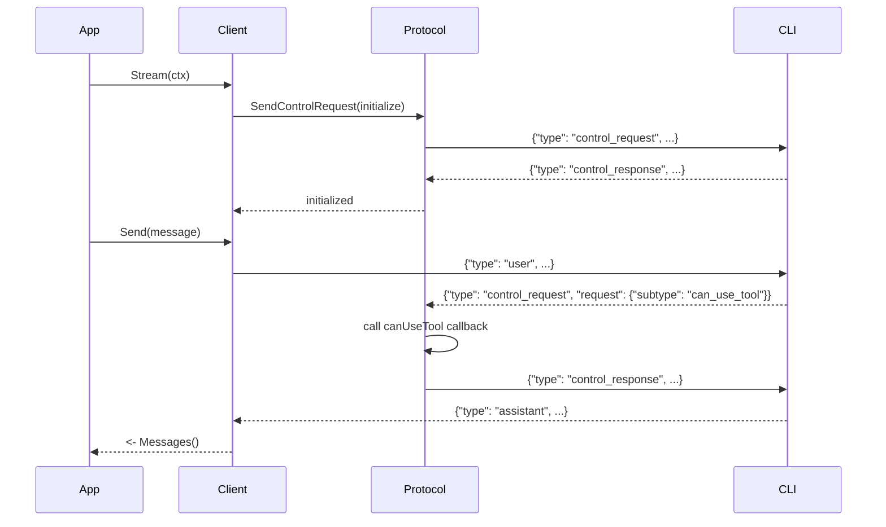

# Step 4: 制御プロトコル実装

## 目的

双方向ストリーミングモードでの制御プロトコルを実装する。
CLIからの制御リクエストに応答し、SDKからの制御リクエストを送信できるようにする。

## 成果物

- `claude/client.go` - ClaudeClient（双方向ストリーミング）
- `internal/protocol/control.go` - 制御リクエスト/レスポンス

## 主要な実装

### 4.1 ClaudeClient

```go
type ClaudeClient struct {
    opts      *Options
    transport transport.Transport
    protocol  *ProtocolHandler

    msgChan chan Message
    errChan chan error
}

func NewClient(opts *Options) *ClaudeClient
func (c *ClaudeClient) Stream(ctx context.Context) (*Stream, error)
func (c *ClaudeClient) Send(msg UserMessage) error
func (c *ClaudeClient) Interrupt() error
func (c *ClaudeClient) Close() error
```

### 4.2 ProtocolHandler

```go
type ProtocolHandler struct {
    transport transport.Transport

    // SDK → CLI のリクエスト管理
    pendingRequests map[string]chan *ControlResponse
    requestCounter  uint64

    // CLI → SDK のコールバック
    canUseTool CanUseToolFunc
    hooks      map[string][]HookCallback
    mcpServers map[string]*SDKMCPServer

    mu sync.RWMutex
}

func (h *ProtocolHandler) SendControlRequest(ctx context.Context, req any) (any, error)
func (h *ProtocolHandler) HandleIncoming(msg RawMessage) error
```

### 4.3 制御リクエストの種類

#### SDK → CLI

- `initialize` - ストリーミングモード開始
- `interrupt` - 実行中断
- `set_permission_mode` - 権限モード変更
- `set_model` - モデル変更
- `rewind_files` - ファイルチェックポイント巻き戻し

#### CLI → SDK

- `can_use_tool` - ツール使用許可確認
- `hook_callback` - フック実行
- `mcp_message` - MCPサーバーへのリクエスト

## シーケンス図



## 完了条件

- [ ] ClaudeClientが双方向ストリーミングできる
- [ ] initializeリクエストが送信できる
- [ ] CLIからのcan_use_toolリクエストに応答できる
- [ ] interruptで実行を中断できる
