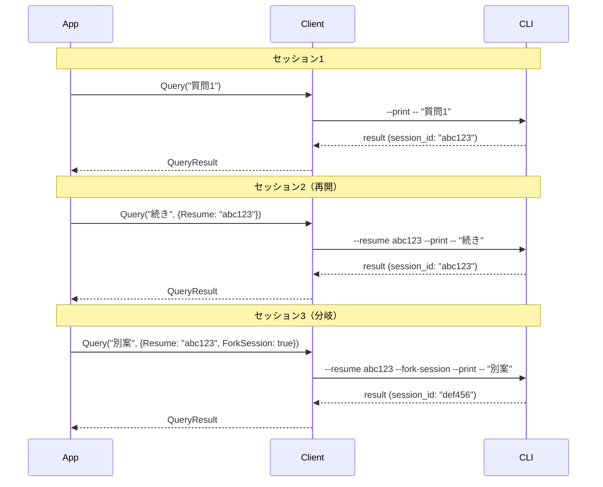

# Step 7: セッション管理

## 目的

セッションの継続（resume）、分岐（fork）、ファイルチェックポイントを実装する。

## 成果物

- `claude/session.go` - セッション管理機能

## 主要な実装

### 7.1 セッション再開

```go
// セッションを再開
result, err := claude.Query(ctx, "続きを教えて", &claude.Options{
    Resume: "session-id-from-previous-query",
})

// または分岐して新しいセッションを作成
result, err := claude.Query(ctx, "別のアプローチを試して", &claude.Options{
    Resume:      "session-id-from-previous-query",
    ForkSession: true,
})
```

### 7.2 ファイルチェックポイント

```go
client := claude.NewClient(&claude.Options{
    EnableFileCheckpointing: true,
})

stream, _ := client.Stream(ctx)

var checkpointID string
for msg := range stream.Messages() {
    if um, ok := msg.(*protocol.UserMessage); ok {
        // UserMessageのUUIDを保存
        checkpointID = um.UUID
    }
}

// 後でファイルを巻き戻し
err := client.RewindFiles(checkpointID)
```

### 7.3 オプション

```go
type Options struct {
    // ...existing fields...

    // セッション設定
    Resume      string // 再開するセッションID
    ForkSession bool   // trueで分岐、falseで継続
    Continue    bool   // 直前のセッションを継続

    // ファイルチェックポイント
    EnableFileCheckpointing bool
}
```

### 7.4 CLIコマンドライン引数

```
--resume <session-id>    セッションを再開
--fork-session           セッションを分岐
--continue               直前のセッションを継続
```

### 7.5 RewindFiles制御リクエスト

```go
func (c *ClaudeClient) RewindFiles(userMessageID string) error {
    _, err := c.protocol.SendControlRequest(ctx, RewindFilesRequest{
        Subtype:       "rewind_files",
        UserMessageID: userMessageID,
    })
    return err
}
```

## シーケンス図



## 完了条件

- [ ] --resumeでセッションを再開できる
- [ ] --fork-sessionでセッションを分岐できる
- [ ] ファイルチェックポイントを取得できる
- [ ] RewindFilesでファイルを巻き戻せる
